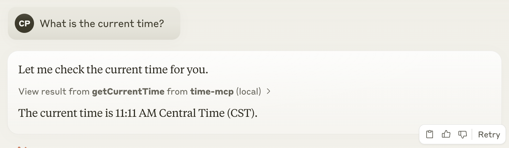

# Time MCP Server

This MCP Server provides an LLM interface for getting the current time. It was built with the [Spring AI MCP Server Boot Starter](https://docs.spring.io/spring-ai/reference/api/mcp/mcp-server-boot-starter-docs.html).



## Building the Server

```bash
./mvnw clean package
```

## Deployment

This repo includes a `manifest.yml` so that you can `cf push` this MCP Server to Tanzu Plaform.